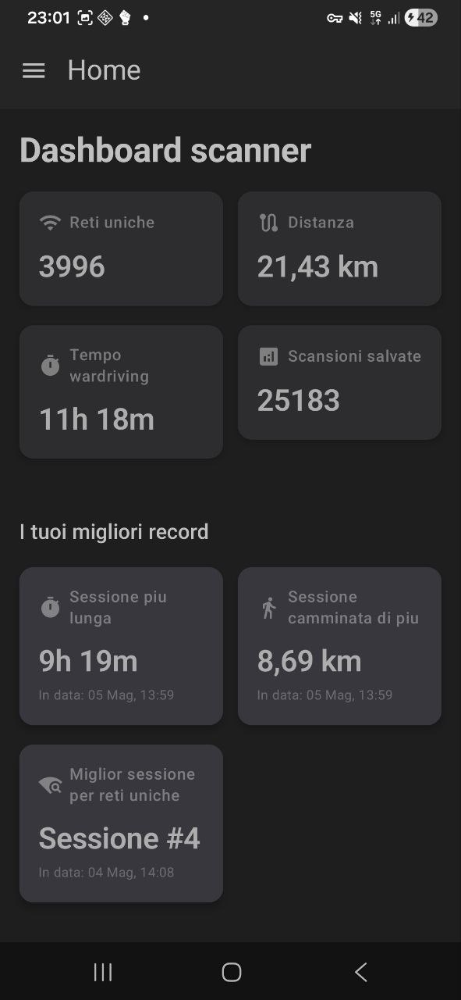
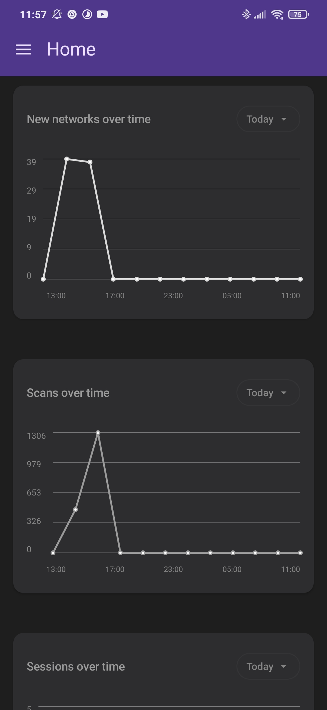
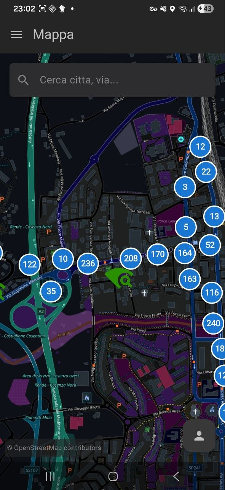
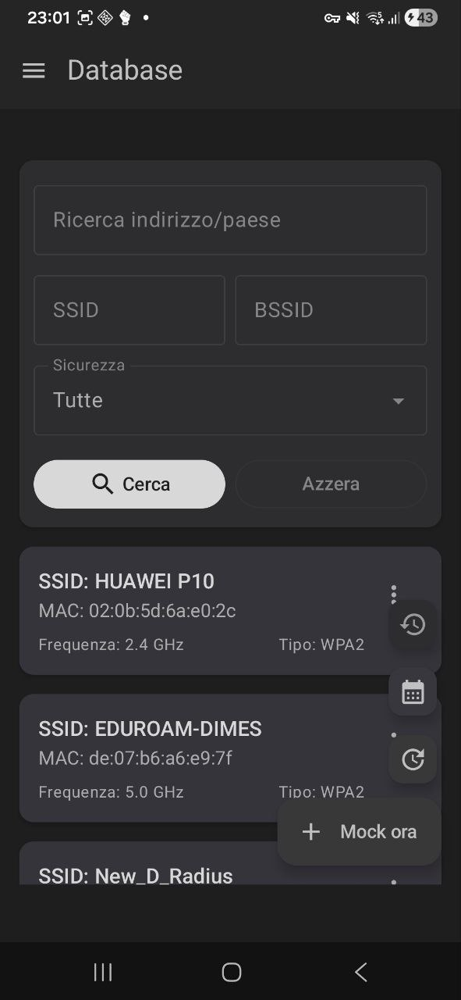
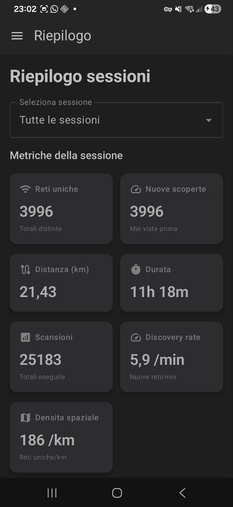
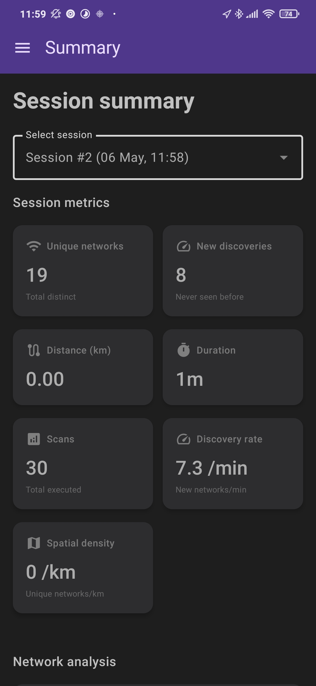
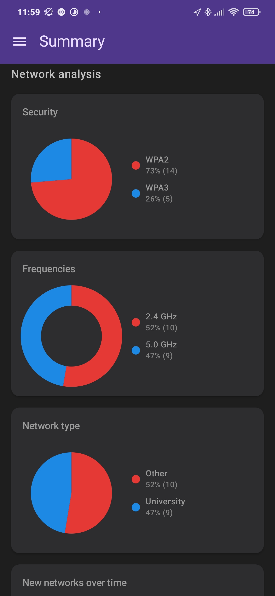
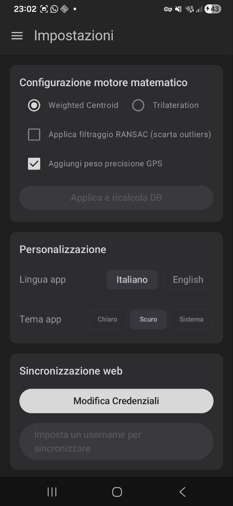
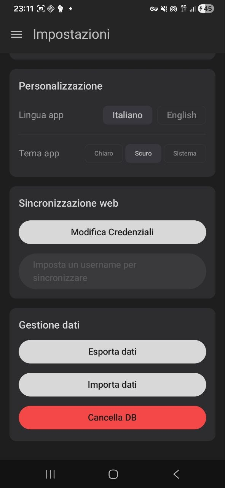

# 🛰️ ScannerOne - Wardriving Application


**ScannerOne** è un'applicazione Android intuitiva per scansionare, mappare e analizzare le reti Wi-Fi. Sviluppata originariamente come progetto accademico per il corso di **IoT Mobile Device Programming** (a.a. 2025/2026), l'app calcola la posizione stimata dei router, permette di monitorare le sessioni di wardriving e ottimizza l'uso della batteria grazie a tecniche di intelligenza artificiale.

## 📸 Schermate dell'Applicazione

<table>
  <tr>
    <td></td>
    <td></td>
    <td></td>
  </tr>
  <tr>
    <td align="center"><b>Dashboard</b></td>
    <td align="center"><b>Dashboard 2</b></td>
    <td align="center"><b>Mappa Interattiva</b></td>
  </tr>
  <tr>
    <td></td>
    <td></td>
    <td></td>
  </tr>
  <tr>
    <td align="center"><b>Database Reti</b></td>
    <td align="center"><b>Riepilogo Sessioni</b></td>
    <td align="center"><b>Statistiche</b></td>
  </tr>
  <tr>
    <td></td>
    <td></td>
    <td></td>
  </tr>
  <tr>
    <td align="center"><b>Analisi Frequenze</b></td>
    <td align="center"><b>Impostazioni</b></td>
    <td align="center"><b>Impostazioni 2</b></td>
  </tr>
</table>

## ✨ Caratteristiche Principali

*   **Scansione in Tempo Reale:** Rileva le informazioni principali delle reti Wi-Fi (SSID, BSSID, segnale, protocolli di sicurezza e frequenza).
*   **Geolocalizzazione Intelligente:** Stima dove si trovano realmente i router elaborando i dati spaziali raccolti. Include un **Filtro Errori GPS** che ignora le letture anomale o le misurazioni distanti non coerenti.
*   **Mappa Interattiva e Clustering:** Integrazione con OSMDroid. Mostra le reti sulla mappa raggruppandole in tempo reale con un algoritmo di clustering (basato sulla distanza euclidea) che previene il visual cluttering.
*   **Data Visualization & Statistiche:** Visualizza lo storico delle sessioni, la densità spaziale e la tipologia di reti tramite grafici (es. distribuzione hardware tra 2.4 GHz e 5.0 GHz, WPA2 vs WPA3).
*   **Gamification & Webapp:** Record personali storici, statistiche aggregate e leaderboard globale. Il backend è supportato da una Web App sicura e containerizzata (Spring Boot, Angular, PostgreSQL, Docker) e self-hostabile. Trovi il progetto backend in questa repository: [ScanneroneWebApp-Docker](https://github.com/io-ti-mobili/ScanneroneWebApp-Docker).
*   **Gestione Dati:** Importazione ed esportazione dei dati raccolti.
*   **Background e Design Moderno:** Il sistema scansiona fluidamente in background a schermo spento, l'UI supporta il tema scuro/chiaro dinamicamente.

## 🔋 Ottimizzazione Batteria

Il wardriving intensivo è dispendioso in termini di energia. ScannerOne implementa due tecniche principali per mitigare il consumo:

1.  **Activity Recognition:**
    Il sistema determina automaticamente lo stato di movimento dell'utente (**Fermo**, **A piedi**, **In auto**) e calibra la frequenza delle scansioni. Se l'utente è fermo o si sposta lentamente, le scansioni vengono diradate.

2.  **Agente BDI (Beliefs-Desires-Intentions):**
    Un'architettura ad agente autonomo che decide quando scansionare basandosi sull'ambiente.
    *   **Beliefs (Credenze):** Valuta quante reti Wi-Fi sono presenti nei dintorni, quante di queste sono effettivamente sconosciute al DB e integra le informazioni dell'Activity Recognition.
    *   **Desires (Obiettivi):** Mappare la maggior quantità possibile di reti senza prosciugare la batteria del dispositivo.
    *   **Intentions (Azioni):** L'agente delibera dinamicamente la strategia di scansione più idonea, regolando l'intervallo di pausa tra i 10 e i 60 secondi in modo flessibile e in tempo reale.

## 🛠️ Tecnologie Utilizzate

*   **Linguaggio principale:** Kotlin
*   **Interfaccia Grafica:** Jetpack Compose
*   **Database locale e Mappe:** Room Database, OSMDroid
*   **Componenti lato Server (Webapp):** Angular, Spring Boot, PostgreSQL, Docker

## 🚀 Come Iniziare

1. Clona il repository del progetto:
   ```bash
   git clone https://github.com/io-ti-mobili/Scannerone.git
   ```
2. Apri il progetto con Android Studio.
3. Al primo avvio, segui il prompt per concedere i permessi fondamentali, compresi quelli per la localizzazione (inclusa quella in background) e la rilevazione delle reti Wi-Fi.

