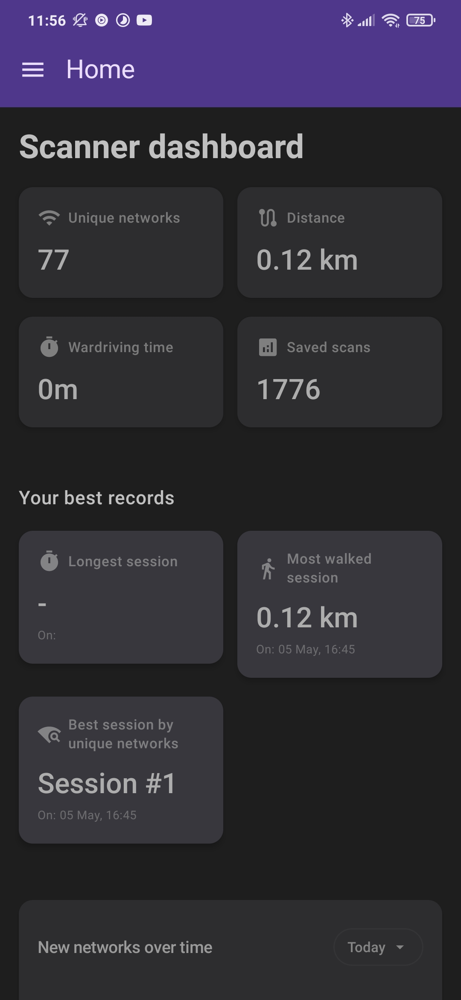
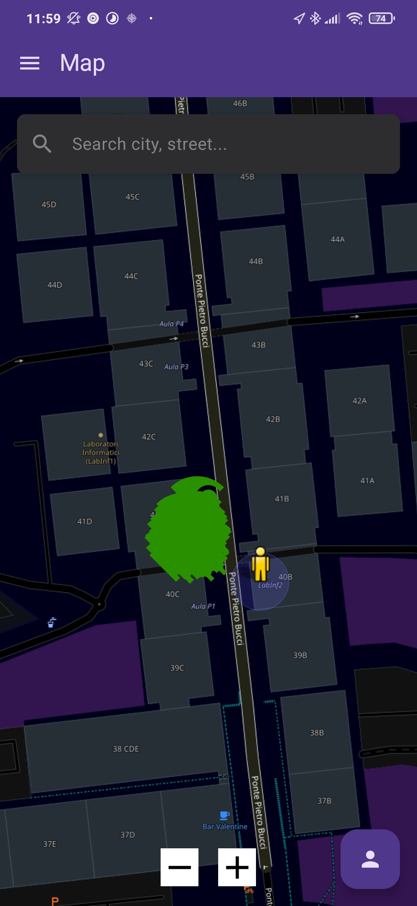
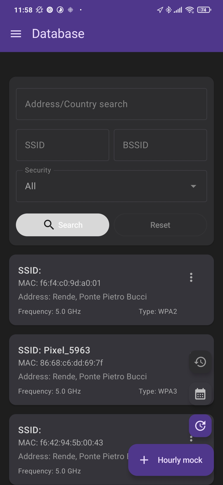
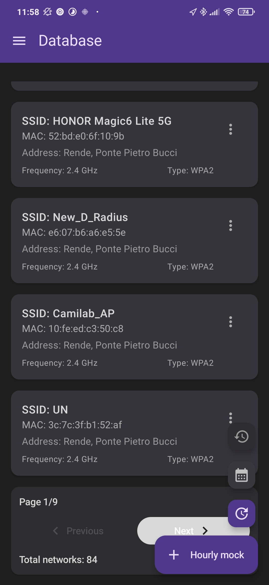
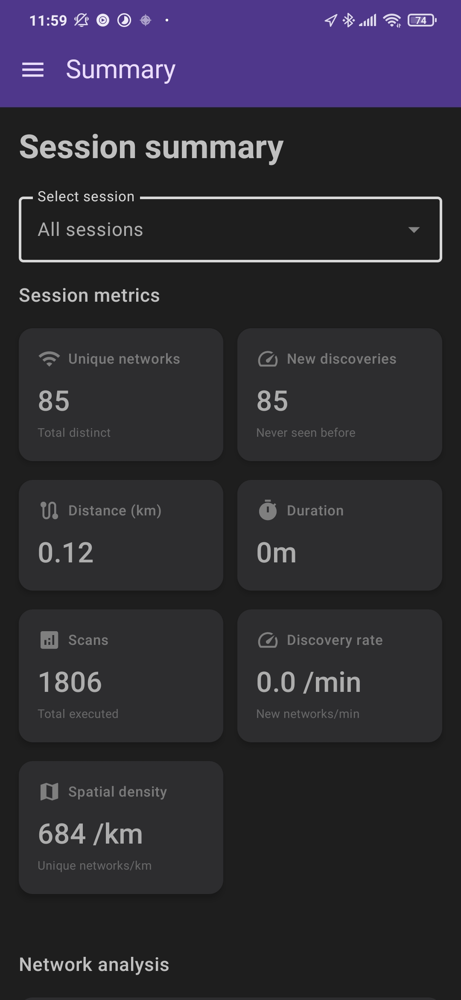
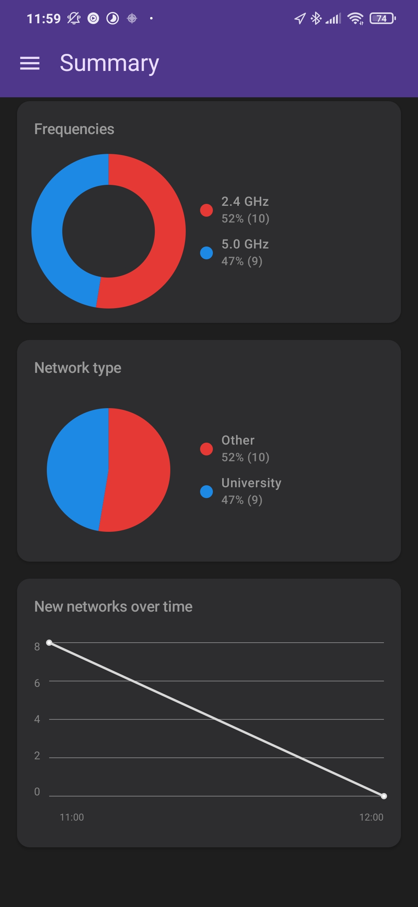
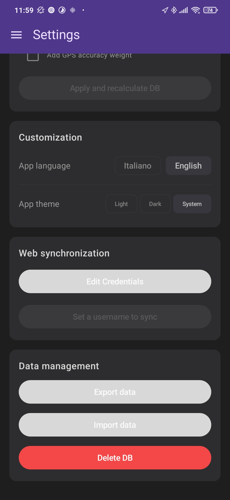
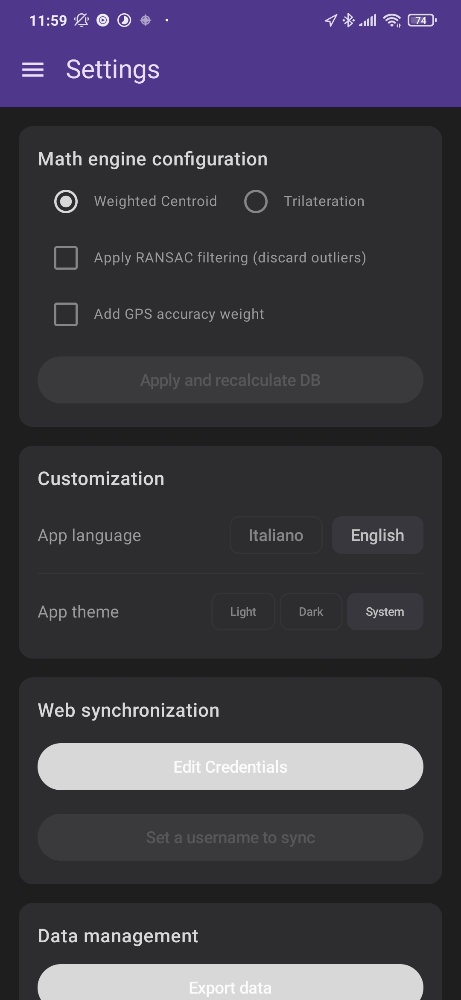

# 🛰️ ScannerOne - App per la Mappatura Wi-Fi

*ScannerOne* è un'applicazione Android intuitiva per scansionare, mappare e analizzare le reti Wi-Fi, sviluppata anche per un progetto accademico. Calcola la posizione stimata dei router e ti permette di monitorare le tue sessioni in modo semplice.

Pensata per funzionare al meglio con le versioni più recenti di Android.

## 📸 Schermate dell'Applicazione

<table>
  <tr>
    <td></td>
    <td></td>
    <td></td>
    <td></td>
    <td></td>
      
  </tr>
  <tr>
    <td align="center"><b>Dashboard</b></td>
    <td align="center"><b>Mappa Interattiva</b></td>
    <td align="center"><b>Database Reti</b></td>
  </tr>
  <tr>
    <td></td>
    <td></td>
    <td></td>
    <td></td>
    <td></td>
    <td></td>
  </tr>
  <tr>
    <td align="center"><b>Riepilogo Sessioni</b></td>
    <td align="center"><b>Analisi Frequenze</b></td>
    <td align="center"><b>Impostazioni</b></td>
  </tr>
</table>

## ✨ Caratteristiche Principali

*   **Scansione in Tempo Reale:** Rileva le informazioni principali delle reti Wi-Fi (nome, segnale e frequenza).
*   **Geolocalizzazione Intelligente:** Stima dove si trovano realmente i router calcolando i dati raccolti e scartando automaticamente gli errori del GPS.
*   **Mappa Interattiva:** Mostra le reti sulla mappa raggruppandole in modo ordinato, permette di cercare aree specifiche e supporta il tema scuro.
*   **Statistiche Chiare:** Visualizza l'andamento delle scansioni e i tipi di rete tramite grafici intuitivi.
*   **Correzione del GPS:** Ignora i finti "salti" del GPS (quando si è fermi) per calcolare correttamente i percorsi.
*   **Gestione dei Dati:** Esporta e importa facilmente le tue sessioni per non perdere alcun dato.
*   **Design Moderno:** Si adatta in automatico al tema chiaro o scuro del tuo telefono.

## 🛠️ Tecnologie Utilizzate

*   **Linguaggio:** Kotlin
*   **Interfaccia Grafica:** Jetpack Compose
*   **Dati e Mappe:** Room Database e OSMDroid
*   **Background:** Il sistema continua a scansionare senza interruzioni anche quando lo schermo è spento.

## 🚀 Come Iniziare

1. Clona il progetto:
   ```bash
   git clone [https://github.com/io-ti-mobili/Scannerone.git](https://github.com/io-ti-mobili/Scannerone.git)
